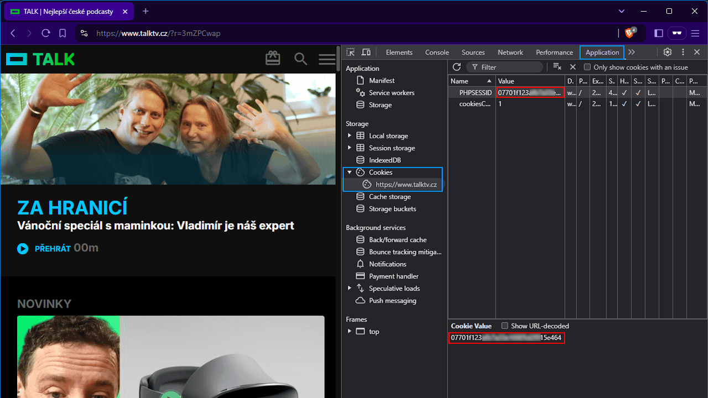

# Kodi doplněk pro TALK.cz (dříve TALKTV.cz, STANDASHOW)

> Napsáno téměř výhradně s pomocí Claude.AI.

Roky jsem byl *čumilem*. Pak jsem se rozhodl stát se platícím členem, asi tři roky platil, ale stále jel v řežimu *čumil* - koukal jsem na streamy, když mě zaujal host a vystačil si s videi na YouTube. No a došlo mi, že platím a nevyužívám čistě proto, že jsem líný opustit Kodi a spustit celou epizodu na [TALK.cz](https://talk.cz).

Jelikož existuje nepřeberné množství podobných doplňků, co jen berou data z webu a servírují videa do Kodi, rozhodl jsem se taky takový zkusit napsat.

Ani pro Kodi ani v Pythonu jsem nikdy nic nepsal, ale s Claudem byla za jedno odpoledne hotová kostra funkčního doplňku a za týden po odpolednách řekl bych slušně fungující doplněk.

## Instalace

Doplněk je dostupný na GitHubu odkud si můžete stáhnout samostatný ZIP, ale doporučoval bych spíš instalaci repozitáře a doplněk poté instalovat z něj - tím by měly být zajištěny aktualizace.

* Repozitář: [repository.mikrom](https://github.com/mikromcz/repository.mikrom)
* Doplněk: [plugin.video.talk.cz](https://github.com/mikromcz/plugin.video.talk.cz)

## Přihlášení

Bohužel, [TALK.cz](https://talk.cz) používá na přihlašovací stránce reCaptchu přes kterou se mi zatím nepodařilo projít. (A kdo ví, jestli podaří.)

V nastavení je tak záložní varianta se zkopírováním session cookie, což je trochu nepohodlné, protože ta cookie má platnost 1 měsíc, takže se to bude muset pravidelně opakovat.

### Nastavení přes prohlížeč

Přidal jsem proto ulehčení ve formě zadání přes prohlížeč. V praxi to funguje takto:

1. V nastavení doplňku povolíte konfigurační stránku a zavřete nastavení kliknutím na tlačítko OK.
2. Na počítači navštívíte `http://<ipaddress>:<port>/talk`, jde `<ipaddress>` je IP adresa zařízení na kterém běží Kodi a `<port>` je port zadaný v nastavení (výchozí je `47447`). Takže např. `192.168.1.103:47447/talk`.
3. Měla by se načíst stránka s detailními instrukcemi jak dál,

    > *1. Klikněte na tlačítko "Otevřít TalkTV Přihlášení" níže* 
    > *2. Přihlaste se přes email a heslo, nebo přes Patreon* 
    > *3. V novém okně klikněte pravým tlačítkem a vyberte "Prozkoumat" nebo stiskněte F12* 
    > *4. Přejděte na záložku "Application" (Chrome) nebo "Úložiště" (Firefox)* 
    > *5. V levém panelu rozbalte "Cookies"* 
    > *6. Najděte "PHPSESSID" a zkopírujte jeho hodnotu* 
    > *7. Vraťte se na tuto stránku a vložte hodnotu níže* 
    > *8. Klikněte na tlačítko "Uložit".* 
    > *9. Pro otestování klikněte na tlačítko "Test".* 
    > *10. Pokud byl test úspěšný, můžete zavřít okno a vypnout konfigurační stránku v nastavení doplňku.*

    1. Obsahuje tlačítko pro otevření přihlašovací stránky TALKu,
    2. kde se přihlásíte přes e-mail/heslo či Patreon,
    3. zkopírujete session cookie, vložíte do políčka a kliknete uložit,
    4. a to je vše.
    5. Můžete udělat test přihlášení.

### Nastavení přes doplněk

1. Přihlašte se normálně v prohlížeči na TALK.cz.
2. Přejděte do Nástrojů pro vývojáře stiskem F12.
3. Najděte hodnotu cookie PHPSESSID a zadejte ji do doplňku 
4. Otestujte funkčnost tlačítkem **Test přihlášení**

### Screenshot PHPSESSID

## Co funguje

* **Funkce**
    * Přihlášení přes PHPSESSID (cookie vykopírované z prohlížeče)
    * Kešování popisů epizod a datumů - menší zátěž pro server Talku, značné zrychlení doplňku
    * Skok na čas, kdy skončila YouTube část videa (Tak trochu. Jen spustí video od času nastaveného v nastavení - průměrná délka YouTube části je cca 22 minut)
    * Živé streamy - aktuálně přes otevření doplňku YouTube

* **Menu**
    * **Hledání**
    * **Poslední videa** - Vlastně stránka "Všechna videa".
    * **Populární videa**
    * **Nejlepší videa** - 16 nejlepších videí. Tahle kategorie ani není na webu 😀.
    * **Pokračovat v přehrávání** - Neaktualizuje se při sledování přes Kodi 😌. (Zatím? 🤔)
    * **Tvůrci** - V podmenu jsou všechny aktuální pořady od STANDASHOW po DESIGN TALK.
    * **Archiv** - V podmenu jsou seznamy videí (IRL, HODNOCENÍ HOSTŮ, VOLBY, ...) a archivované pořady (JARDA VS. NAOMI 🪦).

## Co nefunguje

* **Funkce**
    * Přihlášení přes talktv.cz jméno a heslo.
    * Přihlášení přes Patreon.

## Poznámka

> Neoficiální doplněk bez přímé vazby na TALK TV. Poskytuje přístup k obsahu dostupnému na talktv.cz pro přihlášené uživatele. Veškerý obsah a ochranné známky náleží jejich příslušným vlastníkům.

Doplněk není vyvíjen TALKem, a neposkytují na něj žádnou podporu.

Nicméně jeho existence je Standou povolena 😉

> Předpokládám, že to čte data z webu podobně jako browser jen je rovnou intepretuje do TV UI, right? Tak to je asi ok pokavaď tam funguje přihlášení pro předplatitele a je to chráněno podobně, jako web :)
>
> Takže za mě v pohodě. Díky!
>
> &mdash; STANDASHOW (@StandaShow) [24. 12. 2024](https://x.com/StandaShow/status/1871548140429656072)
