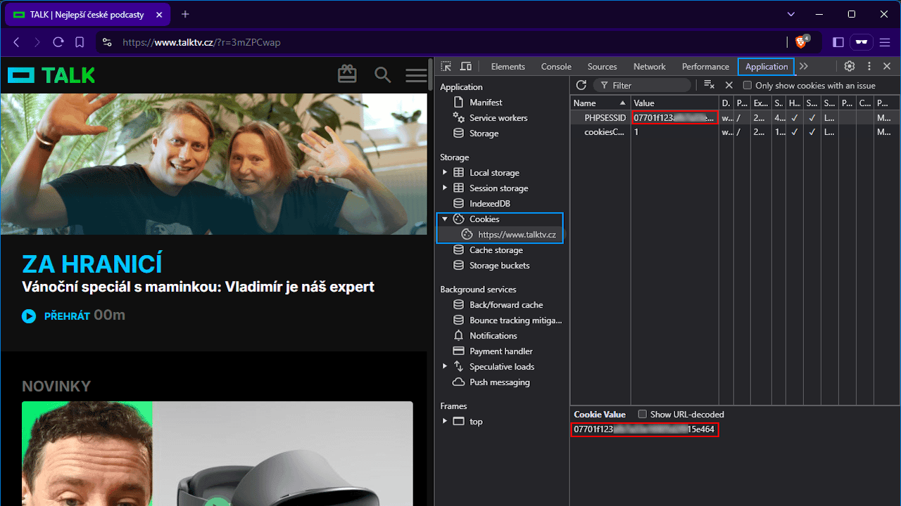

# Kodi doplněk pro TALK.cz (dříve TALKTV.cz, STANDASHOW)

> Napsáno téměř výhradně s pomocí Claude.AI.

Roky jsem byl *čumilem*. Pak jsem se rozhodl stát se platícím členem, asi tři roky platil, ale stále jel v řežimu *čumil* - koukal jsem na streamy, když mě zaujal host a vystačil si s videi na YouTube. No a došlo mi, že platím a nevyužívám čistě proto, že jsem líný opustit Kodi a spustit celou epizodu na [TALK.cz](https://talk.cz).

Jelikož existuje nepřeberné množství podobných doplňků, co jen berou data z webu a servírují videa do Kodi, rozhodl jsem se taky takový zkusit napsat.

Ani pro Kodi ani v Pythonu jsem nikdy nic nepsal, ale s Claudem byla za jedno odpoledne hotová kostra funkčního doplňku a za týden po odpolednách řekl bych slušně fungující doplněk.

> Doplněk vyžaduje aktivní předplatné na [TALK.cz](https://talk.cz)

## Instalace

Doplněk je dostupný na GitHubu odkud si můžete stáhnout samostatný ZIP, ale doporučoval bych spíš instalaci repozitáře a doplněk poté instalovat z něj - tím by měly být zajištěny aktualizace.

* Repozitář: [repository.mikrom](https://github.com/mikromcz/repository.mikrom)
* Doplněk: [plugin.video.talk.cz](https://github.com/mikromcz/plugin.video.talk.cz)
* Fórum: [xbmc-kodi.cz](https://www.xbmc-kodi.cz/prispevek-talk-talk-tv-standashow)

## Přihlášení

Doplněk používá session cookie (PHPSESSID) z přihlášeného prohlížeče. Cookie má platnost 1 měsíc, ale pokud doplněk používáte pravidelně (nebo máte zapnuté sledování TALKNEWS), session se automaticky obnovuje a nemusíte se přihlašovat znovu. V praxi jsem se několik měsíců nemusel přihlašovat a jedu pořád na tu původní session.

### Nastavení přes prohlížeč

Přidal jsem proto ulehčení ve formě zadání přes prohlížeč. V praxi to funguje takto:

1. V nastavení doplňku povolíte konfigurační stránku a zavřete nastavení kliknutím na tlačítko OK.
2. Na počítači navštívíte `http://<ipaddress>:<port>/talk`, kde `<ipaddress>` je IP adresa zařízení na kterém běží Kodi a `<port>` je port zadaný v nastavení (výchozí je `47447`). Takže např. `192.168.1.103:47447/talk`.
3. **Konfigurační server se automaticky vypne po 10 minutách** a zároveň se vypne nastavení "Povolit konfigurační stránku" - dostanete o tom upozornění.
4. Měla by se načíst stránka s detailními instrukcemi jak dál,

    > *1. Klikněte na tlačítko "Otevřít TalkTV Přihlášení" níže* 
    > *2. Přihlaste se přes email a heslo, nebo přes Patreon* 
    > *3. V novém okně klikněte pravým tlačítkem a vyberte "Prozkoumat" nebo stiskněte F12* 
    > *4. Přejděte na záložku "Application" (Chrome) nebo "Úložiště" (Firefox)* 
    > *5. V levém panelu rozbalte "Cookies"* 
    > *6. Najděte "PHPSESSID" a zkopírujte jeho hodnotu* 
    > *7. Vraťte se na tuto stránku a vložte hodnotu níže* 
    > *8. Klikněte na tlačítko "Uložit".* 
    > *9. Pro otestování klikněte na tlačítko "Test".* 
    > *10. Pokud byl test úspěšný, můžete zavřít okno - konfigurační stránka se automaticky vypne po 10 minutách.*

    1. Obsahuje tlačítko pro otevření přihlašovací stránky TALKu,
    2. kde se přihlásíte přes e-mail/heslo či Patreon,
    3. zkopírujete session cookie, vložíte do políčka a kliknete uložit,
    4. a to je vše.
    5. Můžete udělat test přihlášení.
    6. **Server se automaticky vypne po 10 minutách, takže nemusíte na vypnutí myslet.**

### Nastavení přes doplněk

1. Přihlašte se normálně v prohlížeči na TALK.cz.
2. Přejděte do Nástrojů pro vývojáře stiskem F12.
3. Najděte hodnotu cookie PHPSESSID a zadejte ji do doplňku 
4. Otestujte funkčnost tlačítkem **Test přihlášení**

### Screenshot PHPSESSID

## Co funguje

* **Funkce**
    * **Přihlášení přes PHPSESSID** (cookie vykopírované z prohlížeče) - buď ručně, nebo přes webový konfigurační server
    * **Automatický konfigurační server** - webové rozhraní pro jednoduché zadání PHPSESSID s automatickým vypnutím po 10 minutách
    * **Optimalizované session management** - cache s 1hodinovou platností snižuje zátěž serveru o 40-60%, automatický retry při dočasném výpadku sítě
    * **Kešování popisů epizod a datumů** - menší zátěž pro server Talku, značné zrychlení doplňku; cache je nyní spolehlivě aktivní
    * **Timeout 10s pro všechna HTTP volání** - doplněk se nezasekne při pomalém připojení
    * **Skok na čas, kdy skončila YouTube část videa** (Tak trochu. Jen spustí video od času nastaveného v nastavení - průměrná délka YouTube části je cca 22 minut)
    * **Živé streamy** - veřejný "Čumil stream" i exkluzivní VIP stream pro předplatitele (přes doplněk YouTube)
    * **Podpora ukládání pozice přehrávání** - Obousměrně: při přehrávání v Kodi se posílá pozice na web, a pokud je rozkoukáno na webu, tak se v Kodi přehraje od té pozice
    * **Automatické sledování TALKNEWS** - Na pozadí kontroluje novinky a upozorní na ně. Zároveň udržuje session cookie aktivní. Neblokuje ukončení Kodi. Garantovaně běží pouze jedna instance monitoru, i po restartu Python kontextu
    * **Inteligentní notifikace** - Během přehrávání videa se zobrazí jen diskrétní upozornění s ikonou doplňku, detailní informace se zobrazí až po skončení přehrávání
    * **Obsazení s fotografiemi** - Informace o videu obsahují moderátory s jejich fotografiemi pro lepší vizuální zážitek
    * **Kontextové menu** - Přechod na YouTube kanál tvůrce přímo z menu videa (pokud je dostupný)
    * **Sjednocené ikony** - Jednotný vzhled menu s ikonami Font Awesome

* **Menu**
    * **Hledání**
    * **Poslední videa** - Vlastně stránka "Všechna videa".
    * **Populární videa**
    * **Nejlepší videa** - 16 nejlepších videí. Tahle kategorie ani není na webu 😀.
    * **Pokračovat v přehrávání** - Neaktualizuje se při sledování přes Kodi 😌. (Zatím? 🤔)
    * **Tvůrci** - V podmenu jsou všechny aktuální pořady od STANDASHOW po DESIGN TALK.
    * **Archiv** - V podmenu jsou seznamy videí (IRL, HODNOCENÍ HOSTŮ, VOLBY, ...) a archivované pořady (JARDA VS. NAOMI 🪦).
    * **Živě** - Veřejný "Čumil stream" na YouTube + exkluzivní VIP stream pro předplatitele

## Automatické sledování TALKNEWS

Doplněk umí na pozadí sledovat sekci TALKNEWS a upozornit na novinky. Tato funkce má několik výhod:

* **Automatické notifikace** - Při objevení novinky se zobrazí upozornění s ikonou doplňku
* **Inteligentní upozorňování** - Během přehrávání videa jen diskrétní notifikace (název pořadu + titulek), po skončení detailní informace
* **Udržování session** - Pravidelné kontroly udržují session cookie aktivní, takže nemusíte řešit vypršení přihlášení
* **Přímý přístup** - Můžete si nechat novinku rovnou zobrazit v Kodi

### Nastavení

V nastavení doplňku (kategorie **Pokročilé**) najdete:

* **Kontrolovat TALKNEWS** - Zapne/vypne automatické sledování
* **Interval kontroly (hodiny)** - Jak často kontrolovat (1, 3, 6, 12, 24, 48 hodin, výchozí 6 hodin)
* **Resetovat TALKNEWS monitor** - Vymaže posledně vidēnou novinku a restartuje sledování

### Jak to funguje

1. Při prvním spuštění si doplněk zapamatuje aktuálně nejnovější novinku
2. V nastaveném intervalu kontroluje TALKNEWS sekci
3. Pokud najde novou novinku, zobrazí notifikaci a nabídne jehjí přečtení
4. Každá kontrola zároveň "osvěží" session cookie, takže zůstáváte přihlášeni

## Co nefunguje

* **Funkce**
    * Přímé přihlášení přes jméno a heslo (web používá reCAPTCHA)
    * Přihlášení přes Patreon

## Poznámka

> Neoficiální doplněk bez přímé vazby na TALK TV. Poskytuje přístup k obsahu dostupnému na talktv.cz pro přihlášené uživatele. Veškerý obsah a ochranné známky náleží jejich příslušným vlastníkům.

Doplněk není vyvíjen TALKem, a neposkytují na něj žádnou podporu.

Nicméně jeho existence je Standou povolena 😉

> Předpokládám, že to čte data z webu podobně jako browser jen je rovnou intepretuje do TV UI, right? Tak to je asi ok pokavaď tam funguje přihlášení pro předplatitele a je to chráněno podobně, jako web :)
>
> Takže za mě v pohodě. Díky!
>
> &mdash; STANDASHOW (@StandaShow) [24. 12. 2024](https://x.com/StandaShow/status/1871548140429656072)
